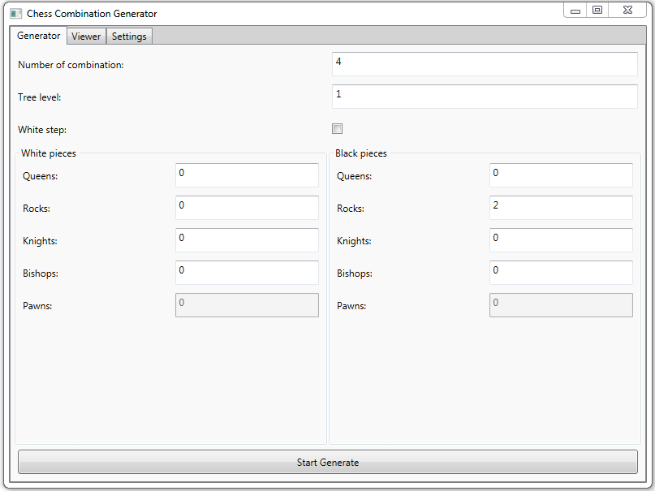

# Chess-Cobination-Generator

It is my test project.

Check List:

-PossibleSteps-Processing

--King-Ok

--Rock-Ok

--Bishop-Ok

--Knight-Ok

--Queen-Ok

--Pawn-

-AI-processing

--Alpha-Betha cutting-processing

--Board Evaluation-processing

-UI-processing

--Board-Ok (I think It is fine)

--Figures-Ok (string characters (Thanks to uicode))
--The player can move

--Menu

---Settings

---Others

-Board Generator-processing

The most imortant thing:

-TEST-TEST-AND TEST

--Speed test

--Memory and CPU test with ANTS or something else

